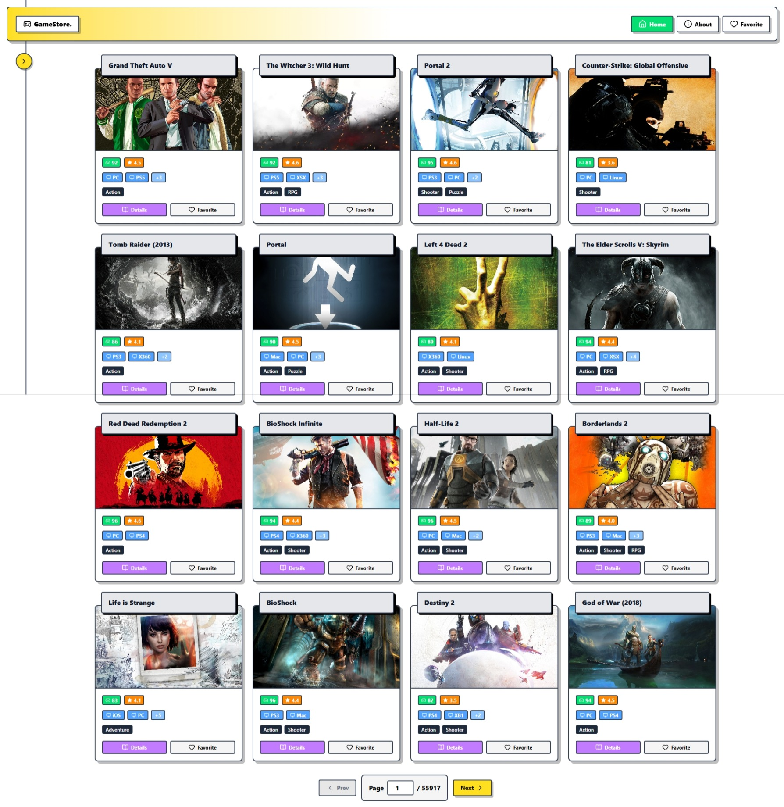
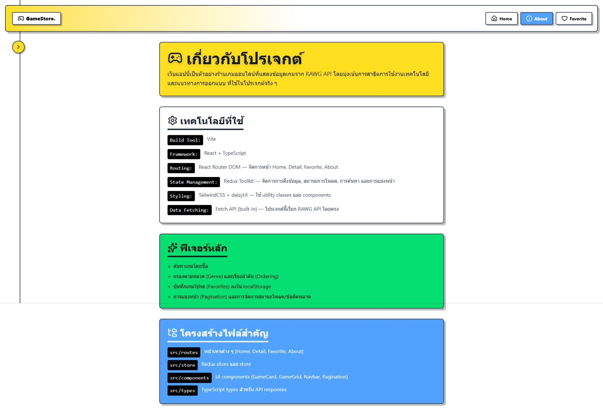
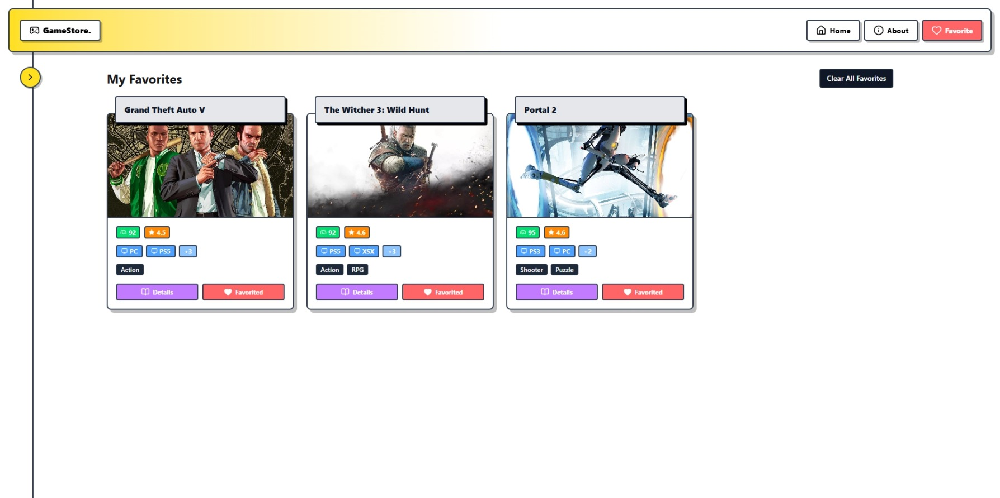
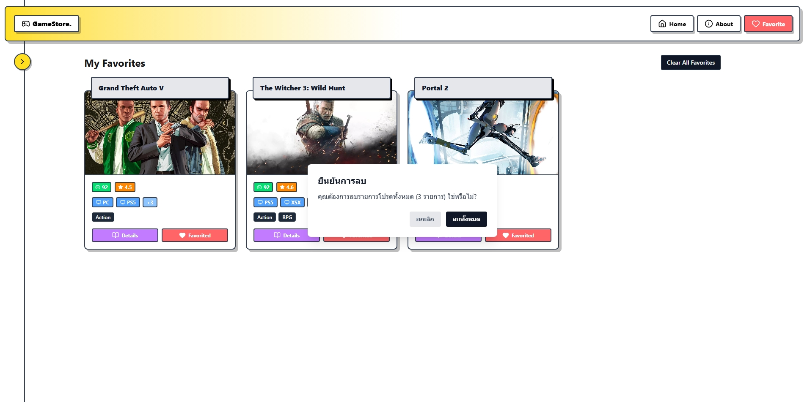
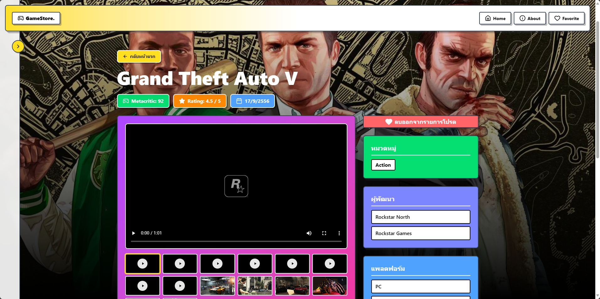
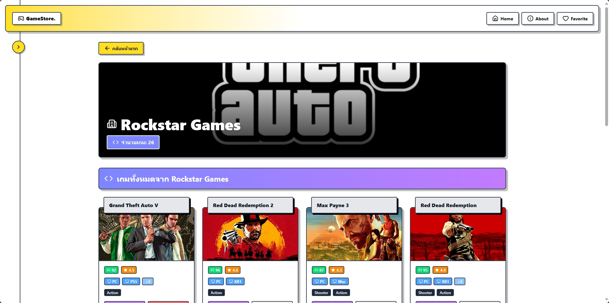

# 🎮 Game Store

Game Store เป็นเว็บแอปแคตตาล็อกเกมที่พัฒนาด้วย React + TypeScript และ Vite — โฟกัสที่การค้นหา เรียกดู และบันทึกเกมที่ชอบ (Favorites) โดยดึงข้อมูลจาก RAWG API

ภาพตัวอย่าง (ไฟล์เก็บใน src/assets/)
- 🏠 หน้าโฮม  
  
- 📋 Sidebar / เมนู  
  
- ℹ️ About / ข้อมูลโครงการ  
  
- 💖 Favorites (ตัวอย่าง)  
  
- 🧹 Clear favorites (ตัวอย่าง)  
  
- 🎯 หน้า Game Detail  
  
- 👩‍💻 Developer page  
  
- ⚛️ React logo (asset)  
  

สารบัญ
- ✨ คำอธิบายสั้น ๆ
- 🛠️ เทคโนโลยีที่ใช้
- 🚀 การติดตั้งและรัน (Local)
- 🔐 ตัวแปรสภาพแวดล้อม (ENV)
- 📁 โครงสร้างไฟล์สำคัญ
- 🧪 การทดสอบ / ตรวจสอบ
- 🤝 การมีส่วนร่วม
- 📄 ไลเซนส์ / ติดต่อ

✨ คำอธิบายสั้น ๆ
Game Store ดึงข้อมูลเกมจาก RAWG API เพื่อแสดงรายการเกมแบบหน้าการ์ด มีระบบค้นหา กรอง การจัดเรียง และหน้ารายละเอียดเกม พร้อมระบบ Favorites ที่เก็บไว้ใน localStorage

🛠️ เทคโนโลยีที่ใช้ (ตามโค้ดในโปรเจกต์)
- React (v19) + TypeScript  
- Vite — build & dev server  
- React Router DOM — routing  
- Redux Toolkit + react-redux — state management (store, slices)  
- TailwindCSS + daisyUI — styling & components  
- lucide-react — ไอคอนหลักใน UI  
- axios — ใช้ในหน้ารายการ Favorites (เรียก API เพื่อดึงข้อมูลแต่ละ id)  
- ESLint / typescript-eslint — linting & quality  
- @vitejs/plugin-react, @tailwindcss/vite — Vite plugin ที่ใช้งาน

(รายการข้างต้นมาระบุจากไฟล์ใน src/ และ package.json ของรีโป)

🚀 การติดตั้งและรัน (Local)
1. ติดตั้ง dependencies
   ```bash
   npm install
   # หรือใช้ pnpm / yarn ตามที่คุณชอบ
   ```
2. รันในโหมดพัฒนา
   ```bash
   npm run dev
   ```
3. สร้าง production build
   ```bash
   npm run build
   ```
4. ตรวจสอบไฟล์ build แบบ local preview
   ```bash
   npm run preview
   ```

🔐 ตัวแปรสภาพแวดล้อม (ENV)
ไฟล์ใช้ RAWG API key ผ่าน environment variable ที่ชื่อ:
- VITE_RAWG_API_KEY — คีย์สำหรับ RAWG API

ตัวอย่าง .env.local:
```
VITE_RAWG_API_KEY=your_rawg_api_key_here
```
หมายเหตุ: ใช้ prefix `VITE_` เพื่อให้ Vite สามารถเข้าถึงผ่าน import.meta.env

📁 โครงสร้างไฟล์สำคัญ (บางส่วน)
- src/
  - assets/ — รูปสกรีนช็อตและไอคอน (ใช้ใน README และ UI)
  - components/ — GameCard, GameGrid, Navbar, Sidebar, Pagination, ฯลฯ
  - routes/ — Home, Detail, Favorite, About, Developer, NotFound
  - store/ — Redux slices (gameSlice.ts, favoritesSlice.ts) + store.ts
  - index.css — นำเข้า Tailwind / daisyUI
  - main.tsx — entry point, RouterProvider, Redux Provider
- package.json — สคริปต์และ dependencies
- vite.config.ts — config ของ Vite (plugin react + tailwind)

🧪 การทดสอบ / ตรวจสอบ
- โปรเจกต์นี้ยังไม่มีชุด unit tests ที่ชัดเจนใน repo — หากต้องการเพิ่ม ให้ใช้ Jest หรือ Vitest พร้อมตัวอย่าง test สำหรับ slice และ utility functions
- คำสั่งที่มีใน package.json:
  - npm run dev — รัน dev server
  - npm run build — สร้าง production
  - npm run lint — รัน ESLint
  - npm run preview — preview build

🤝 การมีส่วนร่วม
- Fork → สร้าง branch ใหม่ feature/<name> หรือ fix/<name>  
- รัน lint และทดสอบก่อนเปิด PR  
- อธิบายการเปลี่ยนแปลงใน PR ให้ชัดเจน (screenshots หากมี UI เปลี่ยนแปลง)

📄 ไลเซนส์ & ติดต่อ
- ใส่ไฟล์ LICENSE ตามที่ต้องการ (เช่น MIT) หากยังไม่มีให้เพิ่มไฟล์ LICENSE  
- ติดต่อผู้พัฒนา: etsuwithtea (GitHub) — https://github.com/etsuwithtea

---
